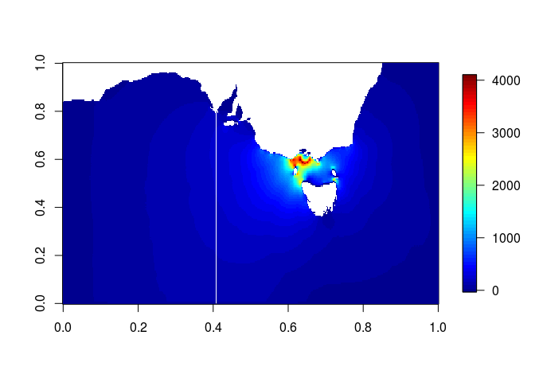
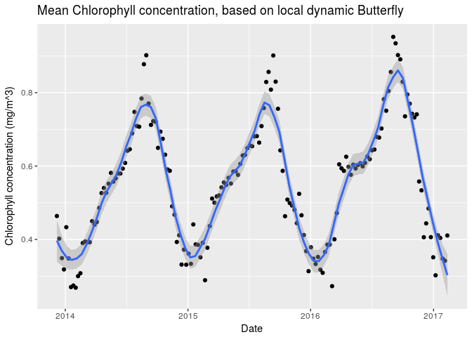
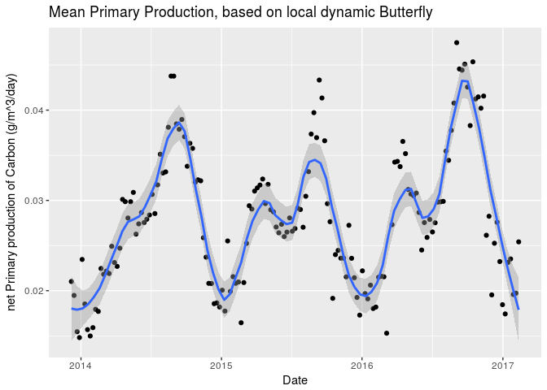
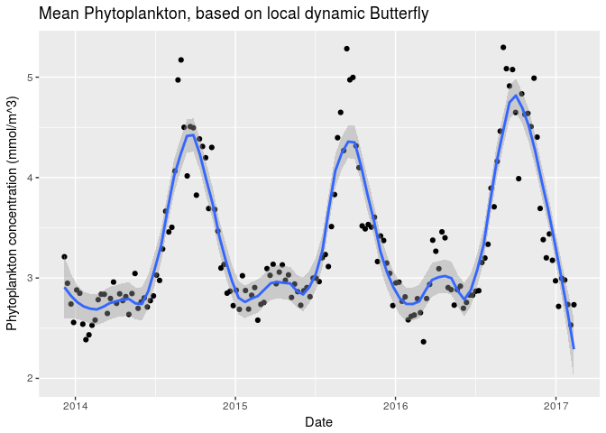

<!-- Do not edit README.md directly, edit README.Rmd instead and re-knit before commit -->
pkgButterfly
============

### Install and load

Install `pkgButterfly` from github if not installed yet.

``` r
devtools::install_github( "rossholmberg/pkgButterfly" )
```

Load the package as well as a few other packages we'll use in this process.

``` r
library( pkgButterfly )
library( magrittr )
library( data.table )
library( plyr )
```

### Chlorophyll analysis

The parameters to the `costCalcMaster` function are as follows.

Central point from which foraging occurs (note areas of land will not be taken into account, so a coastline point is suitable here)

``` r
colony <- c( 145.2, -38.8 )
central.foraging.area <- c( 145.014879, -38.752039 )
```

A file containing currents data needs to be input to the calculations. This data will be used to calculate an "area of influence" (a.k.a "butterfly", due to a shape of which this area may take the form).

``` r
currents.file <- paste0( data.input.folder, "/dataset-armor-3d-v4-cmems-v2_1486508039772.nc" )
```

A folder to be used to temporarily store data created during processing.

``` r
temp.output.folder <- paste0( data.output.folder, "/Rtemp/" )
```

We should also decide on how much leeway to give when matching dates. It is often necessary to find a nearest date match, when no exact match is available. In those cases, how much leeway do we want to allow before giving up (and returning `NA`)?

``` r
buffer.days <- 30
```

If variable names are logical within the .nc file, `costCalcMaster` will find them automatically. If any are strangely names, we may need to specify them in the function call. To get a list of variable names within the file, we can run:

``` r
nc_variableNames( currents.file )
#> [1] "time"        "depth"       "latitude"    "longitude"   "zvelocity"  
#> [6] "height"      "mvelocity"   "salinity"    "temperature"
```

Note the names in this file are fairly logical. We have "lat", "lon", "ZonalCurrent", and "MeridionalCurrent". There is also a "depth" variable here, meaning there may be more than one depth value available. We will only analyse one depth value (multiple values can be analysed by calling `costCalcMaster` within, for example, `lapply` or similar). If more than one depth value is available, it will be necessary to specify which depth to use in the analysis, and which dimension in the currents data represents that depth dimension. We can look at the depths available in the file:

``` r
input.data <- ncdf4::nc_open( currents.file )
depths <- ncdf4::ncvar_get( input.data, varid = "depth" )
depths
#> [1]  0 10 20 30 50 75
```

And we can look at the dimensions of the currents data:

``` r
currents.dim <- dim( ncdf4::ncvar_get( input.data, varid = "zvelocity" ) )
# we can now close the file
ncdf4::nc_close( input.data )
currents.dim
#> [1] 157  81   6 161
```

Notice that there is only one dimension in that data array matching the length of the depths vector. That dimension (here "3") is what the creators of this `.nc` file have deemed the "depth" dimension. Our next call will need this value. Note that in a case like this, where only one dimension matches the size of the depth vector, we can obtain the apropriate value programmatically like so (where there is more than one match, the user will need to input specifically which one represents depths):

``` r
depth.dimension <- which( currents.dim == length( depths ) )
depth.dimension
#> [1] 3
```

Run the main "butterfly" analysis. This can be a very long process. Expect this step to take 10-90mins, depending on the size of the dataset, and the parameters set on input (particularly `dates.range` and `cell.size`).

``` r
conductance.table <- costCalcMaster( output.folder = temp.output.folder,
                                     # dates.range = as.Date( c( "2015-01-01", "2015-08-30" ) ), # uncomment to limit dataset
                                     buffer.days = buffer.days,
                                     currents.file = currents.file,
                                     depth.touse = 0,
                                     depth.dimension = depth.dimension,
                                     POI = central.foraging.area,
                                     foraging.distance = 50,
                                     cell.size = 0.1,
                                     circuitscape.link = ifelse( Sys.info()['sysname'] == "Windows",
                                                                 'C:/"Program Files"/Circuitscape/cs_run.exe',
                                                                 'python2.7' ),
                                     parallel = 6L
)
gc() # collect garbage to clear RAM
```

In some cases, the "dates" values, which now reside in the column names of `conductance.table`, are not in a logical format. It may be a good idea to change these accordingly. Here we use the `ncdf4` package to read in what the creators of this file designated for its time format.

``` r
# get all of the element names (this will include every data value as well)
ncfile <- ncdf4::nc_open( currents.file )
allnames <- names( unlist( ncfile ) )

# remove those names ending with a number
# (these are generally repeated names, meaning they represent data itself, rather than a name)
names <- allnames[ !grepl( "[0-9]$", allnames ) ]

# keep only names beginning with "dim". This *should* represent the dimension values,
# meaning it's the place to look for information about the dimensions of the data
names[ grepl( "^dim", names ) ]
#>  [1] "dim.time.name"                     
#>  [2] "dim.time.len"                      
#>  [3] "dim.time.unlim"                    
#>  [4] "dim.time.group_index"              
#>  [5] "dim.time.group_id"                 
#>  [6] "dim.time.id"                       
#>  [7] "dim.time.dimvarid.id"              
#>  [8] "dim.time.dimvarid.group_index"     
#>  [9] "dim.time.dimvarid.group_id"        
#> [10] "dim.time.dimvarid.list_index"      
#> [11] "dim.time.dimvarid.isdimvar"        
#> [12] "dim.time.units"                    
#> [13] "dim.time.create_dimvar"            
#> [14] "dim.depth.name"                    
#> [15] "dim.depth.len"                     
#> [16] "dim.depth.unlim"                   
#> [17] "dim.depth.group_index"             
#> [18] "dim.depth.group_id"                
#> [19] "dim.depth.id"                      
#> [20] "dim.depth.dimvarid.id"             
#> [21] "dim.depth.dimvarid.group_index"    
#> [22] "dim.depth.dimvarid.group_id"       
#> [23] "dim.depth.dimvarid.list_index"     
#> [24] "dim.depth.dimvarid.isdimvar"       
#> [25] "dim.depth.units"                   
#> [26] "dim.depth.create_dimvar"           
#> [27] "dim.latitude.name"                 
#> [28] "dim.latitude.len"                  
#> [29] "dim.latitude.unlim"                
#> [30] "dim.latitude.group_index"          
#> [31] "dim.latitude.group_id"             
#> [32] "dim.latitude.id"                   
#> [33] "dim.latitude.dimvarid.id"          
#> [34] "dim.latitude.dimvarid.group_index" 
#> [35] "dim.latitude.dimvarid.group_id"    
#> [36] "dim.latitude.dimvarid.list_index"  
#> [37] "dim.latitude.dimvarid.isdimvar"    
#> [38] "dim.latitude.units"                
#> [39] "dim.latitude.create_dimvar"        
#> [40] "dim.longitude.name"                
#> [41] "dim.longitude.len"                 
#> [42] "dim.longitude.unlim"               
#> [43] "dim.longitude.group_index"         
#> [44] "dim.longitude.group_id"            
#> [45] "dim.longitude.id"                  
#> [46] "dim.longitude.dimvarid.id"         
#> [47] "dim.longitude.dimvarid.group_index"
#> [48] "dim.longitude.dimvarid.group_id"   
#> [49] "dim.longitude.dimvarid.list_index" 
#> [50] "dim.longitude.dimvarid.isdimvar"   
#> [51] "dim.longitude.units"               
#> [52] "dim.longitude.create_dimvar"
```

Note that the above represents every available element of the dataset, with nesting levels separated by ".". Note the values beginning with "dim.time" here represent the timeseries data (this may sometimes be named "date", "timestamp", etc. depending on the decisions of the file's creators).

Looking through the names above, it looks like "dim.time.units" is probably what we're looking for. We can look at that element by replacing the "." characters with "$" in an R call, to specify nested list elements:

``` r
ncfile$dim$time$units
#> [1] "hours since 1950-01-01"
ncdf4::nc_close( ncfile )
```

Now we see what the `.nc` file's creators decided as the most appropriate formatting structure for timeseries values. In this case they have represented those values as numeric, specifying the number of "hours since 1950-01-01".

We can use that information to replace the current column names to useful date values. Note we're only changing the values for columns starting from 3, since the first 2 columns are "lat" and "lon"

``` r
library( magrittr )
names( conductance.table )[ 3:ncol( conductance.table ) ] %<>%
    as.numeric() %>% # make sure they're numeric
    divide_by( 24 ) %>% # convert hours to days
    as.Date( origin = "1950-01-01" ) %>% # convert to date, specifying origin
    as.character() # convert to character for use as column names
```

So now the column names in our main dataset should be in a logical date format.

``` r
head( names( conductance.table ), 6 )
#> [1] "lat"        "lon"        "2014-01-01" "2014-01-08" "2014-01-15"
#> [6] "2014-01-22"
```

We can also look at the conductance data itseld. The best way to do this is visually as a spatial plot. Here, we look at a single point in the butterfly over time.

``` r
pkgButterfly::plotButterfly( conductance.table, round( ncol( conductance.table ) - 2L ) * 0.5 )
```



We will specify only one Chlorophyll data file for processing here. It may be worthwhile at times to pass multiple Chlorophyll files for processing against a given conductance dataset, which can be achieved using a looping call such as `plyr::ldply`. Below we will use `plyr::ldply` simply to allow for this possibility should it be needed.

``` r
chl.file <- paste0( data.input.folder, "/dataset-global-analysis-forecast-bio-001-014_1486686773262.nc" )
```

The `pkgButterfly` functions will *attempt* to find logical ways in which data has been stored within the given .nc file. However, since there doesn't seem to be standard for how to store data in .nc files (we should standardise this!), we may need to extract certain things from the file manually. In this case, we'll extract the timeseries data maually, convert it to a logical date format, then pass that to the next function `chlorophyllCalc` to override any automated extraction of that.

``` r
variables.available <- nc_variableNames( chl.file )
variables.available
#> [1] "time_counter" "depth"        "latitude"     "longitude"   
#> [5] "PP"           "CHL"          "PHYC"
```

This time, the timeseries data has been named "time\_counter"

``` r
ncfile <- ncdf4::nc_open( chl.file )
times <- ncdf4::ncvar_get( ncfile, "time_counter" )
head( times )
#> [1] 543468 543636 543804 543972 544140 544308
```

Note again that the timeseries is not in a logical date format, so we must again look into the file to see how they formatted this (this time without the comments, look at the previous similar process for details on each step here).

``` r
allnames <- names( unlist( ncfile ) )
names <- allnames[ !grepl( "[0-9]$", allnames ) ]
names[ grepl( "^dim", names ) ]
#>  [1] "dim.time_counter.name"                
#>  [2] "dim.time_counter.len"                 
#>  [3] "dim.time_counter.unlim"               
#>  [4] "dim.time_counter.group_index"         
#>  [5] "dim.time_counter.group_id"            
#>  [6] "dim.time_counter.id"                  
#>  [7] "dim.time_counter.dimvarid.id"         
#>  [8] "dim.time_counter.dimvarid.group_index"
#>  [9] "dim.time_counter.dimvarid.group_id"   
#> [10] "dim.time_counter.dimvarid.list_index" 
#> [11] "dim.time_counter.dimvarid.isdimvar"   
#> [12] "dim.time_counter.units"               
#> [13] "dim.time_counter.calendar"            
#> [14] "dim.time_counter.create_dimvar"       
#> [15] "dim.depth.name"                       
#> [16] "dim.depth.len"                        
#> [17] "dim.depth.unlim"                      
#> [18] "dim.depth.group_index"                
#> [19] "dim.depth.group_id"                   
#> [20] "dim.depth.id"                         
#> [21] "dim.depth.dimvarid.id"                
#> [22] "dim.depth.dimvarid.group_index"       
#> [23] "dim.depth.dimvarid.group_id"          
#> [24] "dim.depth.dimvarid.list_index"        
#> [25] "dim.depth.dimvarid.isdimvar"          
#> [26] "dim.depth.units"                      
#> [27] "dim.depth.create_dimvar"              
#> [28] "dim.latitude.name"                    
#> [29] "dim.latitude.len"                     
#> [30] "dim.latitude.unlim"                   
#> [31] "dim.latitude.group_index"             
#> [32] "dim.latitude.group_id"                
#> [33] "dim.latitude.id"                      
#> [34] "dim.latitude.dimvarid.id"             
#> [35] "dim.latitude.dimvarid.group_index"    
#> [36] "dim.latitude.dimvarid.group_id"       
#> [37] "dim.latitude.dimvarid.list_index"     
#> [38] "dim.latitude.dimvarid.isdimvar"       
#> [39] "dim.latitude.units"                   
#> [40] "dim.latitude.create_dimvar"           
#> [41] "dim.longitude.name"                   
#> [42] "dim.longitude.len"                    
#> [43] "dim.longitude.unlim"                  
#> [44] "dim.longitude.group_index"            
#> [45] "dim.longitude.group_id"               
#> [46] "dim.longitude.id"                     
#> [47] "dim.longitude.dimvarid.id"            
#> [48] "dim.longitude.dimvarid.group_index"   
#> [49] "dim.longitude.dimvarid.group_id"      
#> [50] "dim.longitude.dimvarid.list_index"    
#> [51] "dim.longitude.dimvarid.isdimvar"      
#> [52] "dim.longitude.units"                  
#> [53] "dim.longitude.create_dimvar"
```

Seeing "dim.time\_counter.units", we can now find the date syntax used in this file.

``` r
ncfile$dim$time_counter$units
#> [1] "hours since 1950-01-01 00:00:00"
```

Note that as with the currents file (both of these files came from the same data source, the European Union's "Copernicus" repository), we need to convert the times from a numeric "hourse since 1950-01-01 00:00:00":

``` r
library( magrittr )
times %<>%
    as.numeric() %>%
    divide_by( 24 ) %>%
    as.Date( origin = "1950-01-01" )
head( times )
#> [1] "2011-12-31" "2012-01-07" "2012-01-14" "2012-01-21" "2012-01-28"
#> [6] "2012-02-04"
```

Then process the chlorophyll file to achieve an output chlorophyll measurement for each available date. Note that each dated chlorophyll matrix must have conductance data against which to apply the algorithm. We can specify a buffer time as `max.day.diff` which will allow some leeway here, such that slight mismatches in conductance data and chlorophyll data can be tolerated (either a single match, or extrapolated data between nearest before and after data points will be used).

Note that in the following call we use `depth.dimension = NULL` (let the function attempt to automatically find which dimension represents the depth variable) and `depth.touse = NULL` (use, by default, the shallowest depth value available). Each of these values can be left out of the following call, since `NULL` is the default for both; they are shown here only to highlight them for your awareness.

``` r
dates.chlorophyll <- plyr::ldply( .data = chl.file,
                                  .fun = chlorophyllCalc,
                                  data.variable = "chl",
                                  depth.dimension = NULL,
                                  depth.touse = NULL,
                                  timeseries = times,
                                  conductance.data = conductance.table,
                                  max.day.diff = buffer.days,
                                  .parallel = FALSE ) %>%
  setDT() %>%
  # for duplicates (useful in cases where more than one file has been analysed) take an average
  .[ , mean( mean.chlorophyll ), by = date ] %>%
  # sort by date
  setorder( date ) %>%
  # make sure the column names are appropriate
  setnames( c( "date", "mean.chlorophyll" ) )
gc() # collect garbage to clear RAM
```

What we're left with is a data frame displaying dates and chlorophyll values.

``` r
head( dates.chlorophyll )
#>          date mean.chlorophyll
#> 1: 2013-12-07        0.4638718
#> 2: 2013-12-14        0.4022076
#> 3: 2013-12-22        0.3491838
#> 4: 2013-12-28        0.3184212
#> 5: 2014-01-04        0.4334572
#> 6: 2014-01-11        0.3483841
```

We can now plot the results:

``` r
library( ggplot2 )
ggplot( data = dates.chlorophyll, mapping = aes( x = as.Date( date ), y = mean.chlorophyll ) ) +
    geom_point() +
    geom_smooth( method = "loess", span = 0.2 ) +
    ggtitle( "Mean Chlorophyll concentration, based on local dynamic Butterfly" )
```



The above shows interpolated chlorophyll level over time, for the specified area of interest (a radius of `foraging.distance` km around `POI`).

#### Analysis of other variables

Note that what we've done so far is to compute a "Butterfly" area, then apply that area to interpolate available Chlorophyll data in the most meaningful way. This is what `pkButterfly` was designed to do, being based on the research of Afan et.al on Chlorophyll specifically.

If we so wish however, we can apply the butterfly area to variables other than Chlorophyll. For example, the file referenced here contains data for "net\_primary\_productivity\_of\_carbon" as well:

``` r
dates.PP <- plyr::ldply( .data = chl.file,
                         .fun = chlorophyllCalc,
                         data.variable = "PP",
                         timeseries = times,
                         conductance.data = conductance.table,
                         max.day.diff = buffer.days,
                         .parallel = FALSE ) %>%
    setDT() %>%
    # for duplicates (useful in cases where more than one file has been analysed) take an average
    .[ , mean( mean.chlorophyll ), by = date ] %>%
    # sort by date
    setorder( date ) %>%
    # make sure the column names are appropriate
    setnames( c( "date", "mean.pp" ) )
gc() # collect garbage to clear RAM
```

``` r
library( ggplot2 )
ggplot( data = dates.PP, mapping = aes( x = as.Date( date ), y = mean.pp ) ) +
    geom_point() +
    geom_smooth( method = "loess", span = 0.2 ) +
    ggtitle( "Mean Primary Production, based on local dynamic Butterfly" )
```



Likewise, we have included in this file the data for "mole\_concentration\_of\_phytoplankton\_expressed\_as\_carbon\_in\_sea\_water":

``` r
dates.Phyto <- plyr::ldply( .data = chl.file,
                         .fun = chlorophyllCalc,
                         data.variable = "PHYC",
                         timeseries = times,
                         conductance.data = conductance.table,
                         max.day.diff = buffer.days,
                         .parallel = FALSE ) %>%
    setDT() %>%
    # for duplicates (useful in cases where more than one file has been analysed) take an average
    .[ , mean( mean.chlorophyll ), by = date ] %>%
    # sort by date
    setorder( date ) %>%
    # make sure the column names are appropriate
    setnames( c( "date", "mean.phyto" ) )
gc() # collect garbage to clear RAM
```

``` r
library( ggplot2 )
ggplot( data = dates.Phyto, mapping = aes( x = as.Date( date ), y = mean.phyto ) ) +
    geom_point() +
    geom_smooth( method = "loess", span = 0.2 ) +
    ggtitle( "Mean Phytoplankton, based on local dynamic Butterfly" )
```


